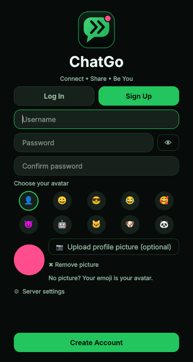
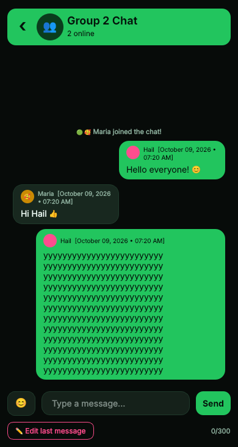

<p align="center"></p>

# ChatGo

A local multi-user chat app made with **Python**, **PyQt6** and **sockets**.
Final project for **OOP 2** (BS Computer Engineering) by **Group 2**.

| Log in | Sign up | Chat list | Group chat |
|:--:|:--:|:--:|:--:|
|  |  |  |  |

## Features

- Login and sign up with a **username and password** (passwords are saved as salted hashes)
- **Display name and avatar**: pick an emoji avatar and optionally upload a profile picture
- **Chat thread** with the username, avatar and **date and time** of every message
- **300 character limit** per message (live counter)
- **Emoji picker** (😊 button)
- **Send button** (Enter also sends) and an **Edit last message** button
- **Local multi-user mode**: several users chat at the same time through the server
- Group chat plus private messages, unread counters, online status and saved history
- Green and black theme with a pink accent, custom logo, phone-sized window (390 x 844)

## How it works

```
 client (main.py)  <-- text messages over TCP -->  server.py  -->  users.json, history.json
 client (main.py)  <-------------------------------^
```

Each message is one line of JSON, for example
`{"type": "message", "to": null, "text": "Hi!"}`. The server saves it and sends it to
everyone (group chat) or only to the two users (private chat). Every client has a
background thread that listens for new messages so the window never freezes.

## Files

| File | What it does |
|---|---|
| `server.py` | The server: accounts, login, passing messages, saving history |
| `main.py` | Starts the client app |
| `login_window.py` | Log In / Sign Up screen |
| `chat_window.py` | Chat list and conversation screens |
| `emoji_picker.py`, `emojis.py` | The emoji popup and its emoji list |
| `network.py` | Client connection to the server (with a listener thread) |
| `helpers.py` | Logo drawing, avatars, profile pictures, date formatting, window size |
| `styles.py` | Colors and the stylesheet |
| `config.py` | Settings (port, 300 limit, phone size, avatars) |
| `run_local.py` | Starts the server and several clients on one computer |

## How to run

You need **Python 3.10 or newer**.

```
pip install -r requirements.txt
```

**Local multi-user mode** (everything on one computer):

```
python run_local.py          # 2 phone windows
python run_local.py 3        # 3 phone windows
```

Choose **Sign Up** in each window and use a different username for each one.

**Or start things yourself** (use one terminal for each):

```
python server.py
python main.py
python main.py
```

**Different computers on the same Wi-Fi:** run `python server.py` on one computer, then on the
others open **Server settings** on the login screen and type the server computer's IP address
(`ipconfig` on Windows). Allow port 5555 in the firewall.

> GitHub only stores the code. It cannot run the server for you.

## Limitations

- Messages are not encrypted, so use it on a trusted network only
- Profile pictures can only be chosen when signing up
- Data is saved in plain JSON files, which is fine for a class project

## Group 2

BSCpE - OOP 2 - <add member names here>
