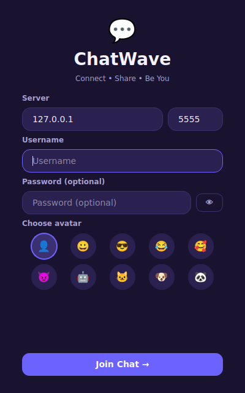
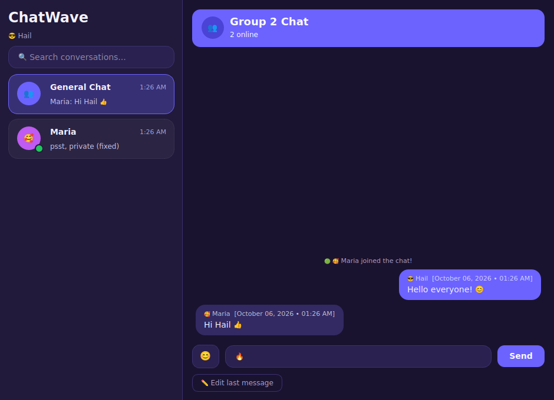
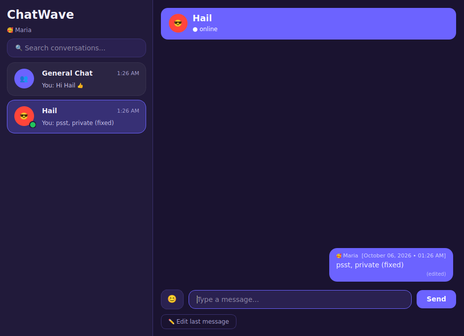
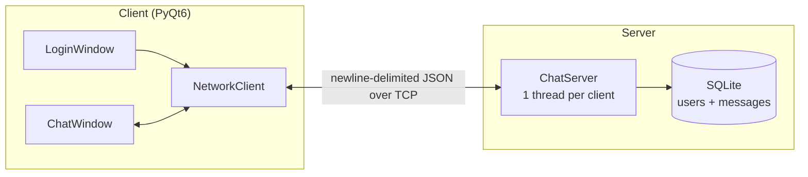

# 💬 ChatWave — Local Multi-User Chat

A desktop chat application built with **Python**, **PyQt6** and **TCP sockets**.
Several users can log in at the same time, chat in a shared room, send private
messages, pick emojis, and edit their last message. Developed by **Group 2** as the
OOP 2 final project (BS Computer Engineering).

| Login | General chat | Direct message |
|:--:|:--:|:--:|
|  |  |  |

## Features

- **Login** — username, optional password (stored as a salted PBKDF2 hash), avatar picker
- **Multi-user chat** — many accounts connected at once through the central server
- **General room + private messages** — click a user in the sidebar to open a DM
- **Chat thread** — avatar, username, date/time, message:
  `😎 Hail [September 12, 2026 • 08:45 AM]: Hello!`
- **Chat list** — last message preview, time, unread badges, online/offline dots, search
- **Emoji picker** — 😊 button with tabs (faces, hands, hearts, animals, objects)
- **Send button** and **Enter to send**
- **Edit last message** — works for real, updates live for everyone (shows *(edited)*)
- **History** — saved in SQLite, so messages are still there after you log back in
- **Purple UI** with an orange complementary accent

## Architecture



**Message flow:** the client sends `{"type":"message","to":null,"text":"Hi"}` →
the server saves it, adds an id and timestamp → it is delivered to everyone (public) or to
sender + recipient only (DM) → each `ChatWindow` stores it and draws a bubble.

### Project structure

```
chatwave/
├── common/protocol.py       # packet format, constants, timestamp helper (shared)
├── server/
│   ├── server.py            # sockets, threads, routing, broadcast
│   └── database.py          # SQLite: accounts, password hashing, history
├── client/
│   ├── app.py               # entry: login -> chat window
│   ├── login_window.py      # login dialog
│   ├── chat_window.py       # sidebar, thread, input, edit logic
│   ├── widgets.py           # AvatarWidget, ConversationTile, MessageBubble, EmojiPicker
│   ├── network.py           # NetworkClient (socket + reader thread -> Qt signals)
│   ├── emoji_data.py        # emoji categories
│   └── theme.py             # colours + stylesheet
├── tests/test_server.py     # integration tests (real sockets)
├── run_server.py            # start the server
└── run_client.py            # start the client
```

OOP concepts used: classes with single responsibilities (`ChatServer`, `Session`, `Database`,
`NetworkClient`), inheritance from Qt classes (`QDialog`, `QFrame`, `QWidget`), encapsulation
(each widget owns its layout), signals/slots (observer pattern), and separation of GUI,
networking and storage.

## Getting started

Requires **Python 3.10+**.

```bash
git clone https://github.com/<your-username>/chatwave.git
cd chatwave
python -m venv .venv
.venv\Scripts\activate          # Windows   (macOS/Linux: source .venv/bin/activate)
pip install -r requirements.txt
```

**1. Start the server** (one computer):
```bash
python run_server.py            # options: --host 0.0.0.0 --port 5555 --db chatwave.db
```

**2. Start a client** (as many windows/computers as you like):
```bash
python run_client.py
```
On the login screen use `127.0.0.1` if the server is on the same computer, otherwise the
server computer's LAN IP (find it with `ipconfig` / `ifconfig`). Allow port **5555** through
the firewall.

> GitHub stores the code but does not *run* it. To let classmates connect from anywhere, run
> the server on one machine on the same Wi-Fi/LAN, or on a small cloud host.

## Tests

```bash
pip install -r requirements-dev.txt
python -m pytest
```
Covers login, wrong/duplicate logins, public broadcast, private DMs, editing rules, history.

## Protocol

One JSON object per line. See [`common/protocol.py`](common/protocol.py) for the full list.

| Direction | `type` | Purpose |
|---|---|---|
| C → S | `login` / `message` / `edit` | authenticate, send, edit own message |
| S → C | `login_ok` / `login_error` | result + user list + history |
| S → C | `message` / `edited` | new or updated message |
| S → C | `presence` / `system` | online status, join/leave notices |

## Known limitations / roadmap

- Traffic is not encrypted (use only on trusted networks; add TLS for real deployments)
- Accounts created without a password can be used by anyone
- Ideas: typing indicator, delete message, image sharing, group rooms

## Team

Group 2 — BSCpE · OOP 2 · <add member names here>

## License

MIT — see [LICENSE](LICENSE).
